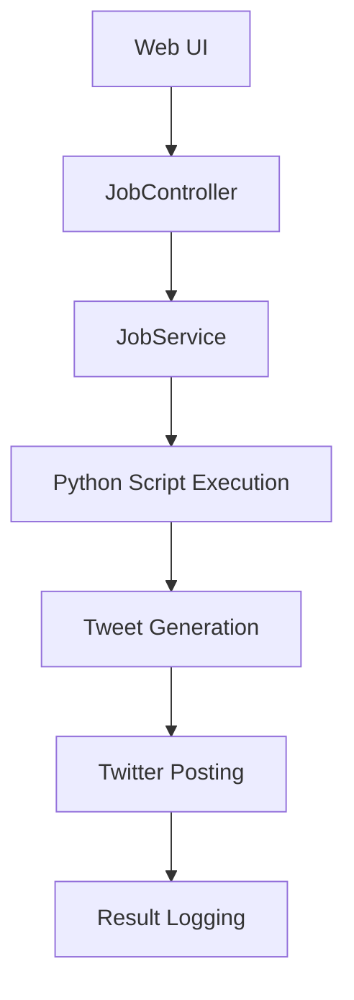
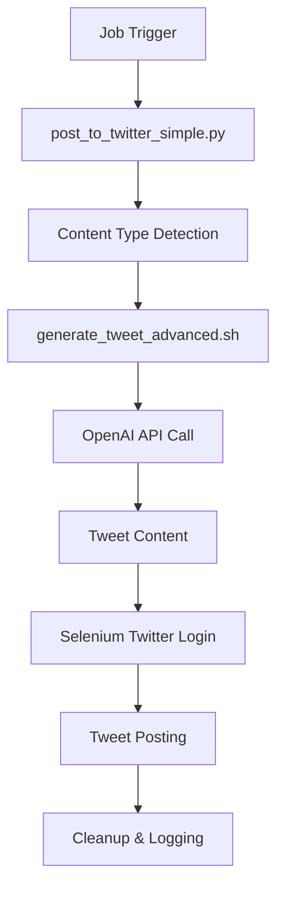

# 📚 YouTubeAI Proje Dokümantasyonu

## 🎯 Proje Genel Bakış

**YouTubeAI**, otomatik sosyal medya içerik üretimi ve paylaşımı için tasarlanmış bir Java Spring Boot uygulamasıdır. Proje, LoFi müzik videoları ve astroloji içerikleri için otomatik tweet üretimi ve paylaşımı yapmaktadır.

### 📋 Ana Özellikler
- **Otomatik Tweet Üretimi**: OpenAI API kullanarak içerik tipine göre tweet üretimi
- **🎬 AI Video Background Generation**: ChatGPT + DALL-E ile configuratif video background üretimi
- **Selenium Twitter Entegrasyonu**: Otomatik tweet gönderimi
- **İçerik Yönetimi**: LoFi müzik, meditation ve horoscope içerikleri
- **Zamanlanmış İş Yönetimi**: Spring Boot ile job scheduling
- **Multi-Channel Support**: Farklı kanallar için ayrı konfigürasyonlar
- **Configuratif Tag Sistemi**: JSON tabanlı esnek yapılandırma

## 🏗️ Teknik Mimari

### Backend (Java Spring Boot)
```
src/main/java/com/youtube/ai/scheduler/
├── SchedulerApplication.java          # Ana uygulama
├── controller/
│   ├── ActionController.java          # Web UI kontrolleri
│   ├── JobController.java             # Job yönetimi API
│   └── LogController.java             # Log yönetimi
├── model/
│   ├── Job.java                       # Job entity
│   ├── JobRun.java                    # Job çalıştırma kayıtları
│   └── ScheduleEntry.java             # Zamanlama ayarları
├── repository/
│   ├── JobRepository.java             # Job veri erişimi
│   └── JobRunRepository.java          # JobRun veri erişimi
└── service/
    ├── JobService.java                # İş mantığı
    └── LogWebSocketHandler.java       # Real-time log streaming
```

### Frontend (Thymeleaf Templates)
```
src/main/resources/templates/
├── index.html                         # Ana sayfa
├── jobs.html                          # Job listesi
├── schedule.html                      # Zamanlama yönetimi
├── logs.html                          # Log görüntüleme
└── fragments/
    └── navbar.html                    # Ortak navigasyon
```

### Shell Scripts Katmanı
```
sh_scripts/
├── post_to_twitter_simple.py         # Ana Twitter posting scripti
├── generate_tweet_advanced.sh        # OpenAI tweet üretimi
├── generate_ai_video_background.sh   # 🆕 AI video background generation
├── generate_video.sh                 # Ana video generation (güncellenmiş)
├── common.sh                          # Ortak fonksiyonlar
├── auto_cleanup.sh                    # Sistem temizliği
├── quick_test.sh                      # Hızlı test sistemi
├── content_configs.json               # 🆕 Configuratif sistem
└── configs/
    └── base.conf                      # Temel konfigürasyon
```

## 🔧 Konfigürasyon Yönetimi

### Environment Variables (channels.env)
```bash
# Twitter Credentials
TWITTER_EMAIL=yusuf.ai.2025.01@gmail.com
TWITTER_USERNAME=LofiRadioAi
TWITTER_PASSWORD=YourPassword

# OpenAI API
OPENAI_API_KEY=sk-your-openai-key

# Content Configuration
CHANNEL_CONFIGS='[JSON array of channel configs]'
```

### İçerik Tipleri
1. **LoFi Content**: Müzik videoları için tweet üretimi
2. **Horoscope Content**: Astroloji burçları için günlük kehanetler

## 🚀 Çalışma Akışı

### 1. Job Oluşturma ve Çalıştırma


### 2. Tweet Üretim Süreci


## 📊 Veritabanı Şeması

### Jobs Tablosu
```sql
CREATE TABLE jobs (
    id BIGINT PRIMARY KEY,
    name VARCHAR(255) NOT NULL,
    description TEXT,
    scripts TEXT,                      -- JSON array of script paths
    schedule_expression VARCHAR(100),  -- Cron expression
    is_active BOOLEAN DEFAULT true,
    created_at TIMESTAMP,
    updated_at TIMESTAMP
);
```

### Job_Runs Tablosu
```sql
CREATE TABLE job_runs (
    id BIGINT PRIMARY KEY,
    job_id BIGINT,
    status VARCHAR(50),               -- SUCCESS, FAILED, RUNNING
    start_time TIMESTAMP,
    end_time TIMESTAMP,
    output TEXT,                      -- Script output
    error_message TEXT,
    FOREIGN KEY (job_id) REFERENCES jobs(id)
);
```

## 🎬 AI Video Generation Sistemi

### Yeni Configuratif Video Generation
**YouTubeAI** artık ChatGPT + DALL-E entegrasyonu ile content type'a göre otomatik video background üretimi yapabilir.

#### Çalışma Prensibi:
1. **Content Type Detection**: JSON config'den content type'ı alır
2. **ChatGPT Prompt Generation**: Visual tag'lere göre detaylı frame açıklamaları üretir
3. **DALL-E Image Generation**: Her frame için high-quality görsel oluşturur
4. **Animation Creation**: FFmpeg ile frame'leri birleştirip GIF/MP4 yapar
5. **Fallback System**: AI başarısız olursa Google Drive'dan fallback

#### Desteklenen Content Types:
- **LoFi**: Cozy study scenes, warm lighting, coffee, books
- **Meditation**: Zen garden, lotus flowers, bamboo, peaceful nature  
- **Horoscope**: Mystical cosmic scenes, galaxies, spiritual symbols

#### Konfigürasyon:
```json
{
  "content_types": {
    "lofi": {
      "video_generation": {
        "visual_tags": ["lofi", "study", "cozy", "coffee"],
        "background_prompt": "Detailed DALL-E prompt",
        "animation_style": "smooth",
        "color_palette": "warm, muted colors",
        "mood": "peaceful and productive"
      }
    }
  },
  "video_generation": {
    "enabled": true,
    "use_ai_generation": true,
    "ai_model": "dall-e-3",
    "frame_count": 4,
    "output_format": "gif"
  }
}
```

## 🔍 Önemli Dosyalar ve İşlevleri

### 1. generate_ai_video_background.sh (YENİ)
- **Ana Fonksiyon**: Content type'a göre AI ile video background üretimi
- **ChatGPT Integration**: Frame açıklamaları için GPT-4 kullanımı
- **DALL-E Integration**: High-quality görsel üretimi
- **Configuratif System**: JSON config'den ayarları okuma
- **Fallback Mechanism**: FFmpeg yoksa PNG, AI başarısız olursa Google Drive

### 2. post_to_twitter_simple.py
- **Ana Fonksiyon**: Twitter'a otomatik tweet gönderimi
- **Selenium Entegrasyonu**: Chrome WebDriver kullanımı
- **Anti-Detection**: Kullanıcı davranışı simülasyonu
- **Profile Management**: Geçici Chrome profilleri

### 3. generate_video.sh (GÜNCELLENDİ)
- **AI Video Generation Integration**: Yeni configuratif sistemi kullanır
- **Content Type Support**: TAG parametresi ile content type belirleme
- **Fallback Chain**: AI → Legacy OpenAI GIF → Google Drive
- **Improved Error Handling**: Daha güçlü hata yönetimi

### 4. generate_tweet_advanced.sh
- **OpenAI Entegrasyonu**: GPT modeli ile tweet üretimi
- **Content Type Handling**: LoFi, Meditation ve Horoscope ayrımı
- **JSON Processing**: API yanıtlarını işleme
- **Error Handling**: API hata yönetimi

### 3. common.sh
- **Config Loading**: channels.env ve JSON config yükleme
- **Multi-Channel Support**: Farklı kanallar için ayrı ayarlar
- **Environment Management**: Ortam değişkenleri yönetimi

## 🛠️ Geliştirme Araçları

### Proje Yönetim Scriptleri
- **project_manager.sh**: Ana yönetim scripti
- **auto_cleanup.sh**: Sistem temizliği
- **quick_test.sh**: Hızlı test sistemi

### Komutlar
```bash
# Proje başlatma
./project_manager.sh clean && ./project_manager.sh start

# Hızlı testler
./project_manager.sh test config
./project_manager.sh test tweet
./project_manager.sh test horoscope

# Sistem durumu
./project_manager.sh status
```

## 🔒 Güvenlik ve Gizlilik

### Credential Management
- Tüm hassas bilgiler `channels.env` dosyasında
- Git'e commit edilmeyen dosyalar
- Runtime'da environment variable olarak yükleme

### Anti-Detection Stratejileri
- Random gecikme süreleri
- İnsan benzeri tıklama davranışları
- Geçici Chrome profilleri
- User-Agent rotasyonu

## 📈 Performans Optimizasyonları

### Chrome Driver Optimizasyonları
- **Headless Mode**: UI olmadan çalışma
- **Profile Reuse**: Hızlı login için profil tekrar kullanımı
- **Resource Blocking**: Gereksiz kaynakları engelleme
- **Fast Mode**: Hızlandırılmış işlem modu

### System Resource Management
- Otomatik Chrome process cleanup
- Geçici dosya temizliği
- Memory leak prevention
- Port conflict resolution

## 🚨 Bilinen Sorunlar ve Çözümleri

### 1. ChromeDriver Çakışmaları
**Sorun**: `user-data-dir already in use` hatası
**Çözüm**: Benzersiz profil dizinleri ve otomatik cleanup

### 2. Twitter Login Sorunları
**Sorun**: Selenium element bulamama
**Çözüm**: Multiple selector stratejisi ve retry logic

### 3. OpenAI API Rate Limiting
**Sorun**: API quota aşımı
**Çözüm**: Retry mechanism ve error handling

### 4. Port Çakışmaları
**Sorun**: Port 8080 zaten kullanımda
**Çözüm**: Otomatik port cleanup ve process killing

## 📝 Geliştirme Notları

### Code Style
- Java: Spring Boot best practices
- Python: PEP 8 compliance
- Shell: POSIX compatibility
- JavaScript: ES6+ features

### Testing Strategy
- Unit tests için JUnit 5
- Integration tests için TestContainers
- E2E tests için Selenium
- Manual testing için quick_test.sh

### Deployment
- Local development: `./gradlew bootRun`
- Production: Docker containerization (gelecek)
- CI/CD: GitHub Actions (planlanan)

## 🔄 Sürekli İyileştirmeler

### Planlanan Özellikler
- [ ] Docker containerization
- [ ] CI/CD pipeline
- [ ] Database migration scripts
- [ ] API documentation (Swagger)
- [ ] Monitoring ve alerting
- [ ] Multi-language support

### Teknik Borç
- [ ] Exception handling standardization
- [ ] Logging framework unification
- [ ] Configuration management refactoring
- [ ] Test coverage improvement

---

**Son Güncelleme**: 21 Haziran 2025
**Versiyon**: 1.0.0
**Geliştirici**: Yusuf & AI Assistant 